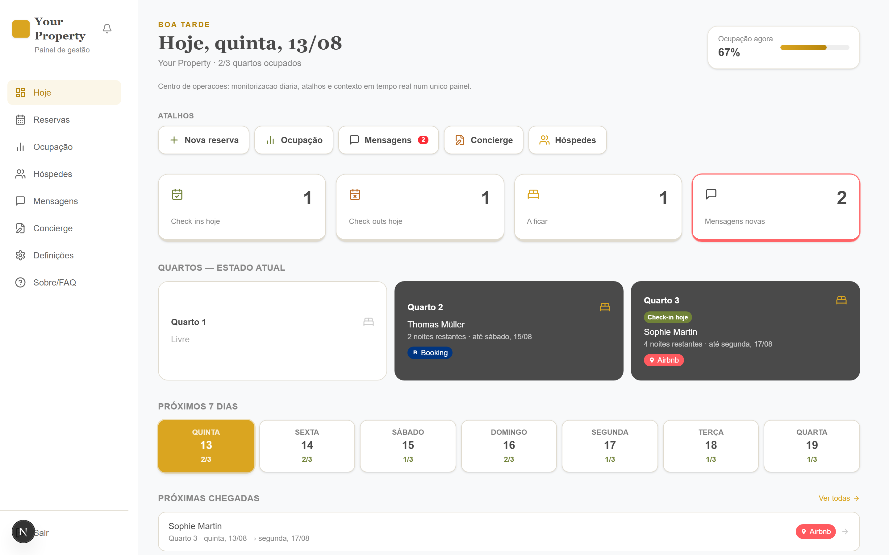
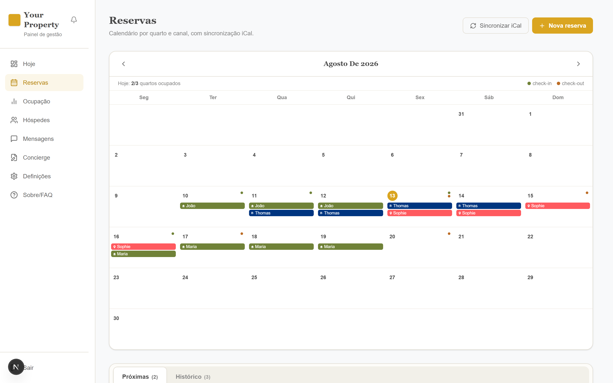
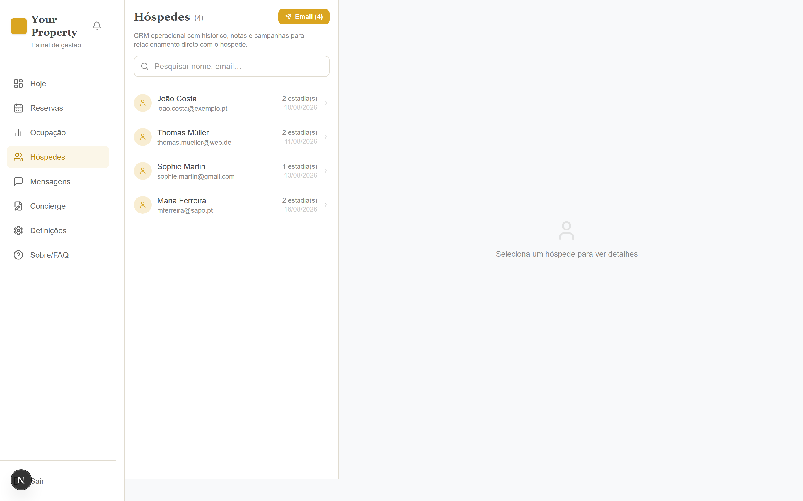
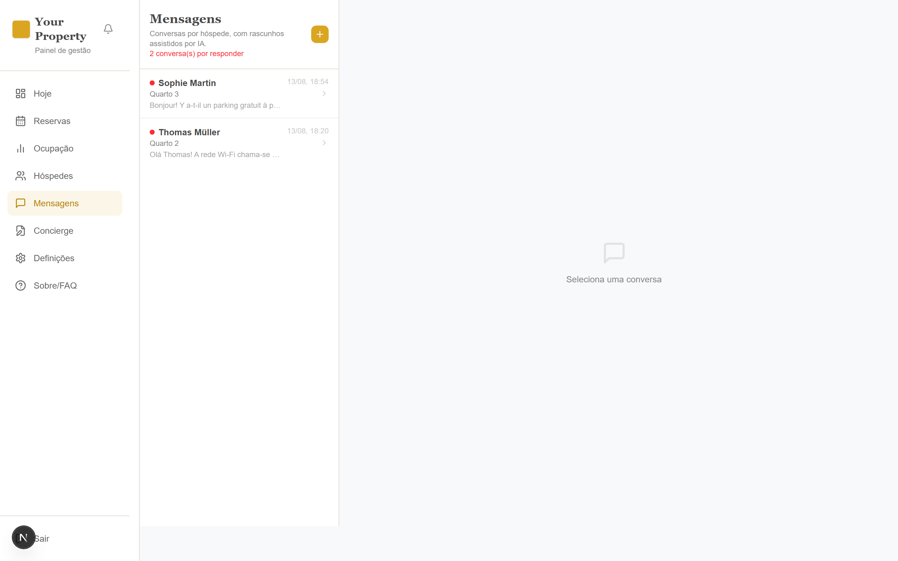
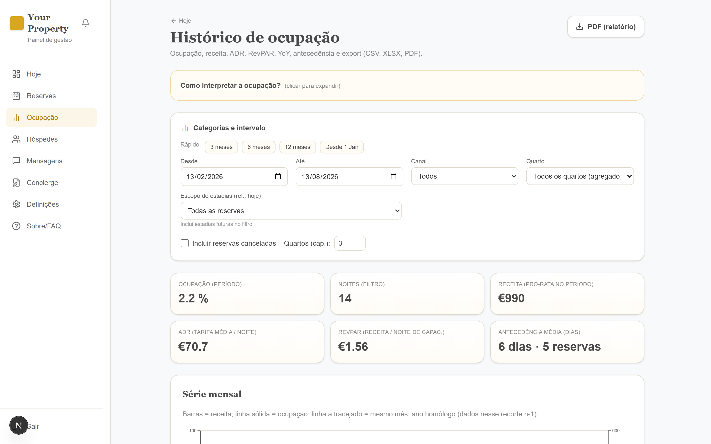
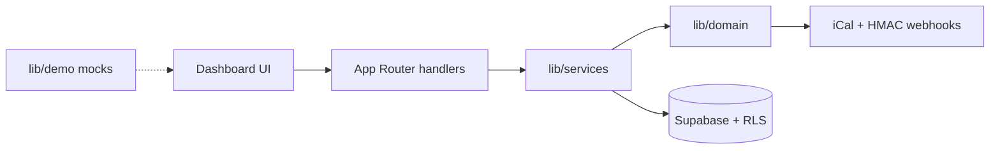

# Hospitality operations dashboard

Ops panel for a small property: reservations, guests, messaging, concierge copy, and occupancy — in one place instead of Airbnb + Booking + WhatsApp + a spreadsheet.

**UI is Portuguese (pt-PT).** Built around a real 3-room operation, then white-labeled so the name is an env var. Unset `NEXT_PUBLIC_SUPABASE_URL` and the app runs on mocks — no backend required.

**[Live demo](https://hospitality-dashboard-theta.vercel.app/)** · [Architecture](#architecture) · [What is not done](#what-is-not-done)

## Live demo

No login. Demo data. Click around.

**https://hospitality-dashboard-theta.vercel.app/**

Local:

```bash
npm install
npm run dev
```

Open [http://localhost:3000](http://localhost:3000). You land on **Hoje**.

## Screenshots

| Today | Reservations |
| --- | --- |
|  |  |

| Guests | Messages |
| --- | --- |
|  |  |



## Problem

Small properties already have demand. What they do not have is a PMS: channel calendars, guest notes, and “did we reply?” live in three tools. This dashboard is the operator’s day view — not a booking website and not an Airbnb clone.

## What it does

- **Today** — occupancy, check-in/out, next 7 days, shortcuts
- **Reservations** — month grid by room and channel (Airbnb / Booking / Direct), CRUD, iCal sync trigger
- **Guests** — searchable CRM, notes, stay history, bulk email via Resend
- **Messages** — threads, mark handled, OpenAI draft replies, scheduled send
- **Concierge** — edit Wi-Fi / check-in copy; public page at `/concierge`
- **Occupancy** — filters, YoY charts, PDF / XLSX / CSV export
- **Settings** — property name, rooms (1–6), times, map

## Architecture



Two runtimes, same UI:

| | Demo | Production |
| --- | --- | --- |
| When | No real `NEXT_PUBLIC_SUPABASE_URL` | Supabase URL + anon key |
| Data | Mocks in `lib/demo.ts` | Postgres + RLS |
| Auth | `proxy.ts` skips login | Supabase Auth cookies |
| Jobs | In-memory queue fallback | `sync_jobs` table + cron routes |

Production-minded pieces: fail-closed cron/internal auth, webhook HMAC with `timingSafeEqual`, service-role only on the server.

## Stack

| Layer | Choice |
| --- | --- |
| App | Next.js 16 (App Router), React 19, TypeScript strict |
| Style | Tailwind CSS 4 |
| Data | Supabase (Auth, Postgres, RLS) — optional |
| Sync | ical.js, durable `sync_jobs` queue |
| AI / email | OpenAI `gpt-4o-mini` drafts, Resend campaigns |
| Charts / export | Recharts, jsPDF, xlsx |
| Maps | Google Maps or MapLibre fallback |

## Production setup

1. Copy [`.env.example`](.env.example) to `.env.local` and fill the **Production: Supabase** block.
2. Apply SQL in `supabase/migrations/` to the project.
3. Set `CRON_SECRET` / `INTERNAL_API_SECRET` on Vercel so job routes stay fail-closed.
4. Optional: iCal URLs, `OPENAI_API_KEY`, `RESEND_API_KEY`, webhook HMAC secrets.

Portuguese operator notes: [DASHBOARD.md](DASHBOARD.md).

## What is not done

Say this out loud. It reads as senior, not unfinished.

- Airbnb / Booking **API clients are stubs**. Inbound iCal and HMAC webhooks exist; availability/pricing push is not live.
- **No Gmail, Outlook, or Google Calendar** sync. Email out is Resend. Calendar in is iCal.
- Extra property cards in Settings are **localStorage only** — ops is one property, up to 6 rooms.
- No test suite or CI yet. `npm run lint` and `npm run build` are the gates.

## Scripts

```bash
npm run dev      # demo on :3000
npm run build
npm run lint
```
